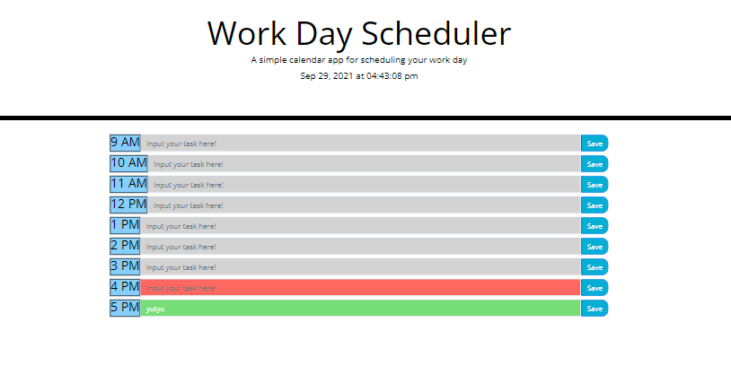
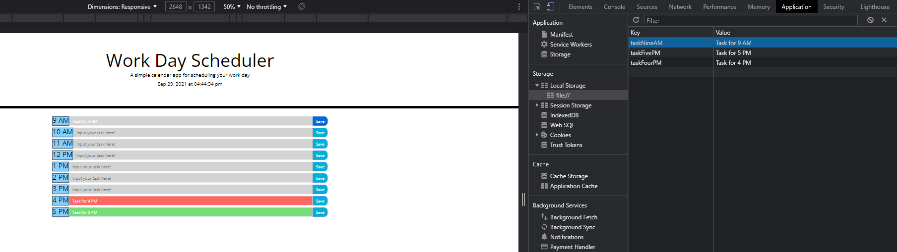

# Password Generator

## Description

This is a a simple calendar application that allows a user to save events for each hour of the day!
This app runs in the browser and features dynamically updated HTML and CSS powered by JavaScript code.

## Table of Contents
- [Installation](#installation)
- [Usage](#usage)
- [Credits](#credits)
- [License](#license)
- [Collaborators](#Collaborators)

## Installation
Current project has been saved in my personal GitHub repository and is currently available for cloning and reviews on:

https://valllerian.github.io/Planner-project/

## Usage

Main page includes the list with available input lines for each hour.
Every hour is updated with the css styling (past\present\future) depending on the time of the day.

 

 

After clicking typing in a "task" for a specific hour and clicking a "save" button
input is being saved in the local storage.
It is being pulled and shown in the input line after refresh or page load.

 

 

## Credits
Following resources  have been used while working on the project:

1) Storage getItem() Method from w3 schools:

https://www.w3schools.com/jsref/met_storage_getitem.asp;

2) val() explained:

https://www.tabnine.com/academy/javascript/get-value-of-input/;

3) List of licenses:

 https://choosealicense.com/;

4) jQuery text() Method explanation:

https://www.w3schools.com/jquery/html_text.asp#:~:text=The%20text()%20method%20sets,content%20of%20ALL%20matched%20elements;

5) Bootstrap form layout:

https://getbootstrap.com/docs/4.0/components/forms/;

## License
Current project is unlicensed. Which means - "Anyone is free to copy, modify, publish, use, compile, sell, or
distribute this software, either in source code form or as a compiled
binary, for any purpose, commercial or non-commercial, and by any
means." (Quote for source #3)

## Collaborators:

Valerii Bihun: valeriibihun.co@gmail.com
